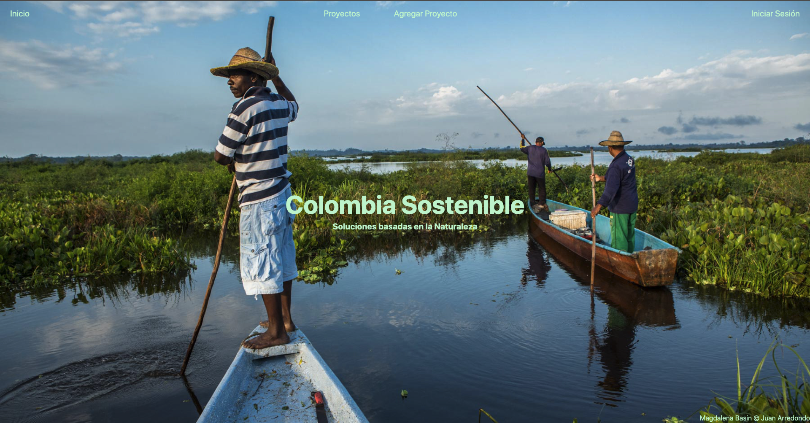

# Nature-Based-Solutions

Welcome to <a href="https://soluciones-naturaleza.herokuapp.com/" target="_blank">Colombia Sostenible</a>!

A collection of nature-based solutions in Colombia.

## Technologies used

* HTML
* Javascript
* Tailwind CSS
* Express and Node JS
* MongoDB and Mongoose
* Passport
* Google Oauth

APIs:
* Leaflet
* Node-Geocoder
* Imgur

## Future Updates
- [ ] Sort projects by category
- [ ] Add a moderator functionality for new projects
- [ ] Add dynamic redirect when logging in
- [ ] Update imgur api functionality to accept multiple images
- [ ] Fix minor responsiveness issues