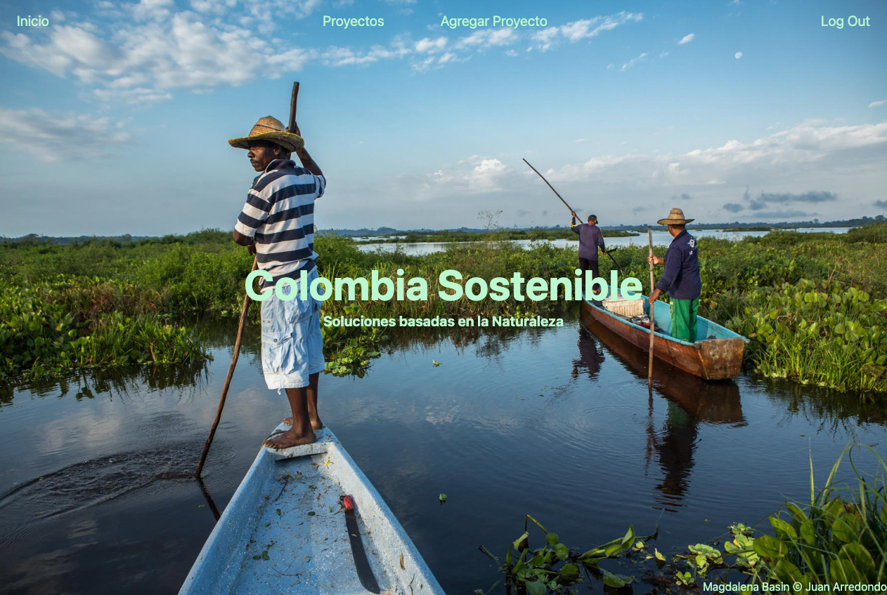
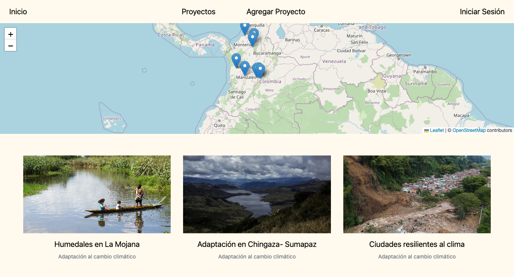
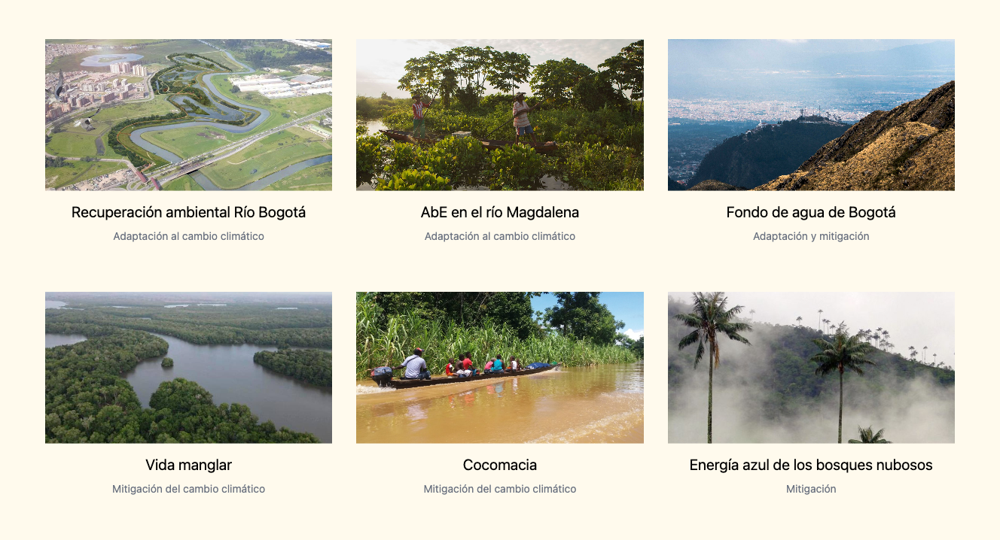
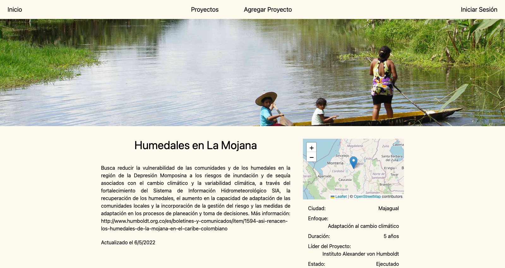
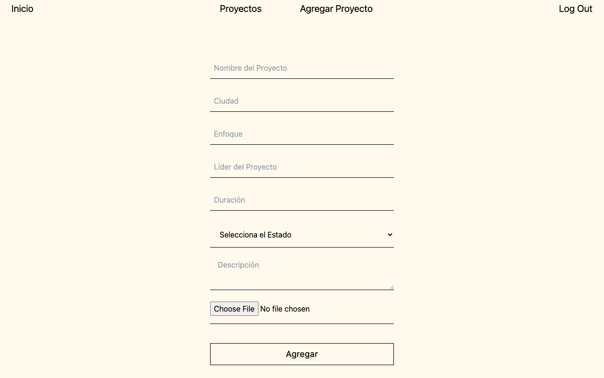

# Nature-Based-Solutions

## The App
Nature-based Solutions (NbS) are widely promoted when formulating climate change adaptation and mitigation measures; due to the multiple environmental, social, and economic benefits they provide. The app showcases NbS for climate mitigation and adaptation in Colombia.
Welcome to <a href="https://soluciones-naturaleza.herokuapp.com/" target="_blank">Colombia Sostenible</a>!

## Images
#### Main Page

 

#### Projects Page

 

#### Projects Detail Page

 

#### Add Project Form

 

## Technologies
* HTML
* Javascript
* Tailwind CSS
* Express and Node JS
* MongoDB and Mongoose
* Passport
* Google OAuth
APIs:
* Leaflet
* Node-Geocoder
* Imgur

## Future Updates
- [ ] Sort projects by category
- [ ] Add a moderator functionality for new projects
- [ ] Add dynamic redirect when logging in
- [ ] Update imgur API functionality to accept multiple images
- [ ] Fix minor responsiveness issues
